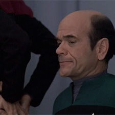

<html>
<head>
<title>RobCARS</title>
<meta name="description" content="RobCARS">
<meta name="keywords" content="LCARS, Website, Template, HTML, CSS, Star Trek">
<meta name="viewport" content="width=device-width, initial-scale=1.0">
<meta name="format-detection" content="telephone=no">
<meta name="format-detection" content="date=no">
<link rel="stylesheet" type="text/css" href="stylesheets/lcars-red-alert.css">
<link rel="preconnect" href="https://fonts.googleapis.com">
<link rel="preconnect" href="https://fonts.gstatic.com" crossorigin>
<link href="https://fonts.googleapis.com/css2?family=Antonio:wght@400;700&display=swap" rel="stylesheet">

<link rel="icon" type="image/png" href="favicon.ico">
<audio loop autoplay><source src="sounds/background/tng_red_alert1.mp3" type="audio/mpeg"></audio>
</head>
<body>

	

		

			
03-111968

            
04-041969

			
05-1701D

			
06-071984

			
07-081940

			
08-47148

			
09-081966

		

		

			
10-31

		

	

	

		

		

		

		

		

		

		

		

			

		

		

    lcars computer access &#149; 404

<h1 class="go-center go-gold">the lcars computer network</h1>
<h2 class="go-center go-bluey">page not found</h2>

    console 67
  

